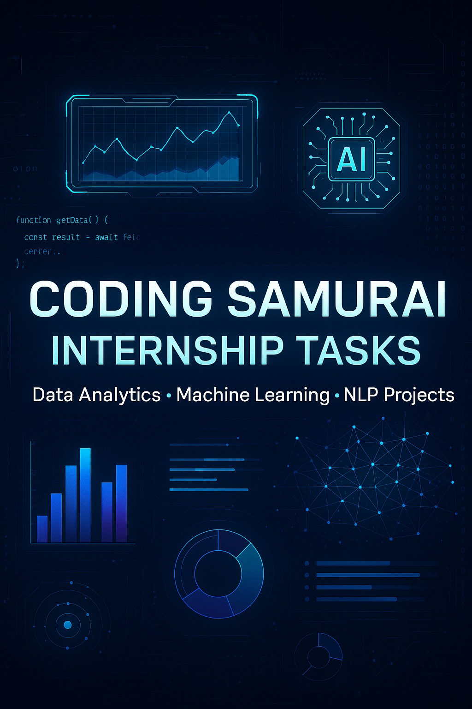

# CODING-SAMURAI-INTERNSHIP-TASK

## 🚀 About
This repository contains all tasks completed during the **Coding Samurai Internship Program** by **Akshat Palia**.

The projects focus on:
- 🔍 **Data Analytics**
- 🤖 **Machine Learning**
- 🧠 **Natural Language Processing (NLP)**

---

## 📂 Tasks

### ✅ Task 1 - Sales Data Analysis
- 📊 Performed Exploratory Data Analysis (EDA) on retail sales data.
- ✅ Cleaned data, handled missing values, and visualized insights.
- 📈 Analyzed sales trends, deal sizes, customer distribution, and more.
- 🛠 Tools: Python, Pandas, Matplotlib, Seaborn.

---

### ✅ Task 2 - Titanic Logistic Regression
- 🚢 Machine learning project to predict survival on the Titanic.
- 🔧 Data preprocessing, feature engineering, and model building.
- 📊 Evaluated model accuracy and visualized results.
- 🛠 Tools: Python, Pandas, Scikit-learn, Matplotlib.

---

### ✅ Task 3 - Sentiment Analysis Plane Crash
- ✈️ NLP-based sentiment analysis on tweets related to a plane crash event.
- 🔥 Applied text preprocessing, sentiment scoring, and data visualization.
- 📊 Analyzed public emotions — Positive, Negative, Neutral.
- 🛠 Tools: Python, Pandas, TextBlob, Matplotlib, Seaborn.

---

## 🛠 Tech Stack
- Python 🐍
- Pandas, NumPy
- Matplotlib, Seaborn, Plotly
- Scikit-learn
- TextBlob / NLTK (for NLP)
- Jupyter Notebook

---

## 🔥 Folder Structure

```plaintext
CODING-SAMURAI-INTERNSHIP-TASK/
│
├── assets/
│   └── banner.png
│
├── Task 1 - Sales Data Analysis/
├── Task 2 - Titanic Logistic Regression/
├── Task 3 - Sentiment Analysis Plane Crash/
│
└── README.md
