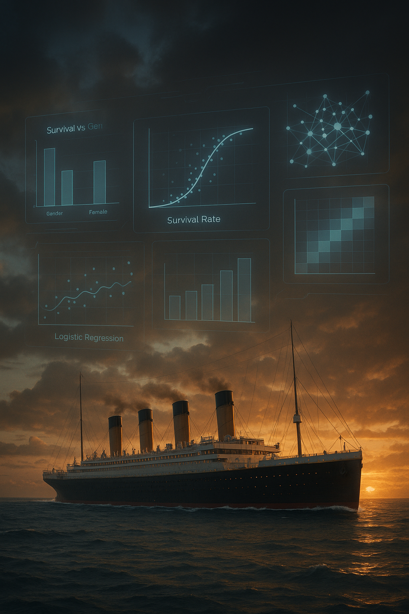

# 🚢 Titanic Survival Prediction - Logistic Regression

## 🚀 Project Overview
This project aims to predict the survival of Titanic passengers using Logistic Regression based on passenger features such as age, sex, and passenger class.

## 📑 Dataset
- Source: [Kaggle - Titanic Dataset](https://www.kaggle.com/competitions/titanic/data)
- File Used: `train.csv`

## 🎯 Problem Statement
Given details about passengers aboard the Titanic, predict whether a passenger survived (`1`) or not (`0`).

## 🛠️ Technologies Used
- Python
- Pandas
- NumPy
- Matplotlib
- Seaborn
- Scikit-learn

## 🔥 Project Steps

### 1. Problem Understanding
- Titanic sank in 1912. Goal: predict survival based on passenger attributes.

### 2. Exploratory Data Analysis (EDA)
- Visualized survival distribution.
- Analyzed gender-wise and class-wise survival.
- Checked distributions of age and fare.
- Identified correlation between features.

### 3. Data Preprocessing
- Filled missing values:
  - `Age` → median
  - `Embarked` → mode
- Dropped columns: `PassengerId`, `Name`, `Ticket`, `Cabin`
- Converted categorical features (`Sex`, `Embarked`) into numeric using one-hot encoding.

### 4. Model Building
- Built Logistic Regression model using Scikit-learn.
- Accuracy Achieved: **81.01%**

### 5. Model Evaluation
- Confusion Matrix
- Classification Report (Precision, Recall, F1-Score)
- ROC Curve with AUC Score

## 📊 Results
| Metric         | Class 0 (Not Survived) | Class 1 (Survived) |
|----------------|-------------------------|---------------------|
| Precision      | 0.83                    | 0.79                |
| Recall         | 0.86                    | 0.74                |
| F1-Score       | 0.84                    | 0.76                |
| **Accuracy**   | \-                      | **81.01%**          |

## 📂 Folder Structure
Titanic_Logistic_Regression/
├── train.csv
├── titanic_logistic.py
├── README.md
├── Titanic_Logistic_Report.pdf
└── requirements.txt

## ✅ Conclusion
- Logistic Regression achieved a balanced and reliable accuracy.
- Gender and Class were significant predictors.
- Future improvements could include advanced models and hyperparameter tuning.

## 🤝 Acknowledgements
- Dataset from [Kaggle Titanic Competition](https://www.kaggle.com/competitions/titanic)

---
